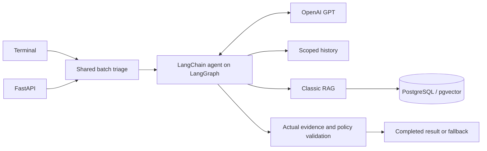

# Support Ticket Triage Agent

Prototype for the **main Word assignment**: classify urgency, extract product/issue/sentiment, retrieve knowledge and choose a draft, specialist route or human escalation. This branch uses **one LangChain agent running on LangGraph, two read-only tools, and shared terminal/API logic**. Docker PostgreSQL/pgvector provides classic RAG; GraphRAG is deferred.

## Clone and run

Requires Git, Docker Desktop with Compose, and your own OpenAI GPT key/model. No key is included. The repository is private: reviewers need access from the owner.

```powershell
git clone --branch feat/langchain-langgraph https://github.com/Watcharaphong-kob/support-ticket-triage-agent.git
cd support-ticket-triage-agent
Copy-Item .env.example .env
# Edit .env: replace POSTGRES_PASSWORD, set OPENAI_API_KEY and OPENAI_MODEL.
docker compose up -d --build api
docker compose run --rm app python -m triage_agent.knowledge.manage ingest
docker compose run --rm app python -m triage_agent --input data/sample_tickets.json --trace
```

Use a GPT model supporting Chat Completions and function calling. Structured output uses LangChain's tool strategy. Compose loads `.env`; host Python reads shell environment variables only. Run from the repository root so relative fixture paths resolve. Keep the same DB password when reusing the persistent volume.

Migration SQL is packaged in `src/triage_agent/knowledge/migrations/`. The repeatable migration enables pgvector and preserves existing records; Compose runs it before application startup.

### API

```powershell
Invoke-RestMethod http://127.0.0.1:8000/health
$json = Get-Content data/sample_tickets.json -Raw -Encoding utf8
Invoke-RestMethod -Method Post -Uri http://127.0.0.1:8000/triage -ContentType 'application/json; charset=utf-8' -Body ([Text.Encoding]::UTF8.GetBytes($json))
```

For bash/curl: `curl -H 'Content-Type: application/json' --data-binary @data/sample_tickets.json http://127.0.0.1:8000/triage`.

[Swagger docs](http://127.0.0.1:8000/docs) and [OpenAPI schema](http://127.0.0.1:8000/openapi.json) describe the ticket input. `GET /health` means the process is alive; it does not verify GPT/DB readiness. API binds to loopback port 8000; change `API_PORT` if occupied. DB binds to loopback 54329; change `POSTGRES_PORT` if occupied. No public deployment/auth is included.

| Request/result | HTTP | CLI exit |
| --- | --- | --- |
| All results completed | 200 | 0 |
| Accepted batch with explicit per-ticket fallback | 200 | 1 |
| Invalid JSON/schema, empty/oversized batch, duplicate IDs | 422 | 2 |
| Missing/invalid required runtime configuration | 503, sanitized | 2 |

One ticket or 1–100 unique tickets are accepted. Validation finishes before provider/tool execution. Both transports return `mode`, `embedding_model` and `results`; CLI stdout is JSON, while `--trace` prints only safe tool status/IDs to stderr. Fallback escalates to `human_support` and includes an error code, never a fake completed classification.

## Test without paid credentials

Docker tests inject scripted chat responses while executing the real LangChain/LangGraph graph, tools and PostgreSQL. An OpenAI key/model is unnecessary for these tests. The source samples, Thai drafts, scoped history, citations, limits, errors, CLI/API parity and overlapping requests are covered.

```powershell
# POSTGRES_PASSWORD still needs a local value in .env.
docker compose up -d --build app
docker compose run --rm -e TRIAGE_TEST_DATABASE=1 app python -m pytest -q -p no:cacheprovider
```

Expected current full image suite: **78 passed, 1 skipped**. The skip needs the host Docker CLI; run `uv run --locked python -m pytest tests/test_compose.py -q` on the host. Tests use disposable uniquely named DB schemas and preserve normal ingested data.

For host development, install Python 3.11+ (tested 3.12) and uv 0.12.6:

```powershell
uv sync --locked
uv run --locked triage-agent --help
uv run --locked python -m pytest -q
uv run --locked python -m ruff check src tests scripts
uv run --locked python -m ruff format --check src tests scripts
uv run --locked python scripts/build_planner.py
uv run --locked python scripts/check_delivery.py
uv build
```

Host DB tests skip unless `TRIAGE_TEST_DATABASE=1` and `PGHOST=127.0.0.1`, `PGPORT=54329`, `PGUSER=triage`, `PGDATABASE=triage`, `PGPASSWORD=<your local password>` are exported. Containers already supply those settings. CI installs the uv lock, checks docs/resources, builds packages and runs the full Docker suite without paid keys.

The old `--offline` runtime and recorded demo outputs remain on `feat/triage-agent`; this branch has no canned production model. Scripted tests prove wiring and deterministic safeguards, **not GPT decision quality or multilingual semantic retrieval**.

## Tools, output and architecture

`get_customer_history(customer_id)` reads synthetic fixtures and restricts lookup to the ticket's customer. Returns `ok`, disclosed `not_found`, or sanitized `error`. Required nonempty customer ID; extra arguments forbidden.

`search_knowledge_base(query, product?, issue_type?, locale?)` retrieves at most five passages with parameterized read-only PostgreSQL queries. Required nonempty query, maximum 8,000 characters; locale is English/Thai or omitted for cross-language search. Returns source/chunk IDs, title, excerpt, version, locale, mock flag and similarity. Empty success differs from an error; similarity is not confidence.

[Tool schemas and implementations](src/triage_agent/tools.py) become LangChain tools directly. [System prompt](prompts/system.txt) is packaged and checked against its delivery copy. Application-owned execution records, source membership and policy are checked after structured model output. Both real tools must execute before completion; the structured-output helper is not a third business tool or evidence.



Results include urgency, product (null if unknown), issue type, sentiment, secondary issues, action/destination, rationale, optional draft, cited chunk IDs, uncertainties, actual tool records and status/error. Preserve the full conversation and Thai text. Critical incidents route to `incident_on_call` before billing routing; other billing cases require human billing review. Auto-response is a supported low-urgency **draft**, never sent. Missing history/mock evidence is disclosed; no payment settlement, refund, SLA, outage or unsupported feature is invented.

Each ticket permits **6 model requests / 8 actual tool calls**, 30-second GPT timeout, no automatic retries/correction, and 40 graph steps. A built-in all-call guard allows at most 9 calls including the final output helper; the application guard separately enforces 8 real tools and validates complete batches before execution. DB connect/query timeout is 5 seconds. Unknown tools, malformed/foreign requests, failed tools/provider, exhausted budgets, invalid citations/output or invalid language/action policy cause visible fallback. Invocation evidence stays local; no persistent memory/checkpoints or second production loop.

## Live quality and semantic RAG

Default `fake-token-v1` embeddings are deterministic lexical vectors for setup/tests. GPT can use them for a wiring smoke test; they do not prove semantic retrieval. For live embeddings, set `EMBEDDING_BACKEND=openai`, a compatible `EMBEDDING_MODEL`/`EMBEDDING_DIMENSION`, and your own key. **Use a separate Compose project/volume and host ports** to avoid mixing embedding spaces:

```powershell
# Edit .env for your chosen live models first.
$env:POSTGRES_PORT = '54330'
$env:API_PORT = '8001'
docker compose -p ooca-triage-live up -d --build api
docker compose -p ooca-triage-live run --rm app python -m triage_agent.knowledge.manage ingest
docker compose -p ooca-triage-live run --rm app python -m triage_agent --input data/sample_tickets.json --trace
docker compose -p ooca-triage-live down
Remove-Item Env:POSTGRES_PORT, Env:API_PORT
```

Semantic correctness is evaluated separately: manually label held-out English/Thai/mixed and no-answer tickets; assess urgency/action and extraction accuracy, critical false negatives, citation relevance/support, unsupported drafts, retrieval recall@5/MRR, prompt injection, latency, token cost and fallback rate. Repeat live runs and use human review. Sample project expectations are high→billing, critical→incident, low→product support; they are not an employer answer key. [Retrieval details](docs/retrieval_evaluation.md) explain chunking/ranking and embedding-space checks. No paid live GPT or semantic embedding evaluation was run during this delivery.

## Deliverables and scope

- [One-page write-up](WRITEUP.pdf), with [editable source](docs/WRITEUP.md).
- [Main assignment traceability](docs/ASSIGNMENT_REQUIREMENTS.md), [faithful source](docs/assignment_source.json), [offline reader](ASSIGNMENT_READER.html).
- [Spec, architecture, tickets and verification evidence](plan.md); GitHub spec #6 with children #7–#9.
- Source/uv lock/Compose/tests on **feat/langchain-langgraph**. The original prototype branch is preserved.

Knowledge/customer fixtures are synthetic, permitted by the Word assignment. uv, both CLI/API, framework choice and Docker classic RAG are owner scope; the assignment requires at least two tools and allows terminal or API. This prototype needs approved real knowledge, authentication/tenant controls, observability and live evaluation before production. GraphRAG is next phase.

`data/sample_tickets.json` preserves all three assignment conversations, twelve messages, relative times, original Thai and supplied translations; IDs are synthetic, without inferred dates/products or answer labels. `data/customers.json` contains synthetic supplied account context: null means unknown, and billing/outage statements remain customer reports. `data/knowledge_base.json` contains illustrative policies, not verified company policy, refunds, live incidents or feature availability.

`docker compose down` stops this project's containers without deleting the knowledge volume. Repository privacy and reviewer access remain controlled by the owner.
