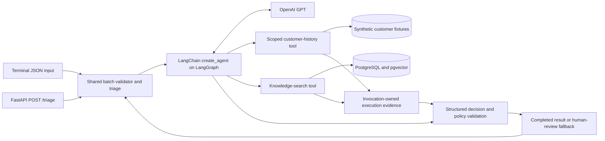
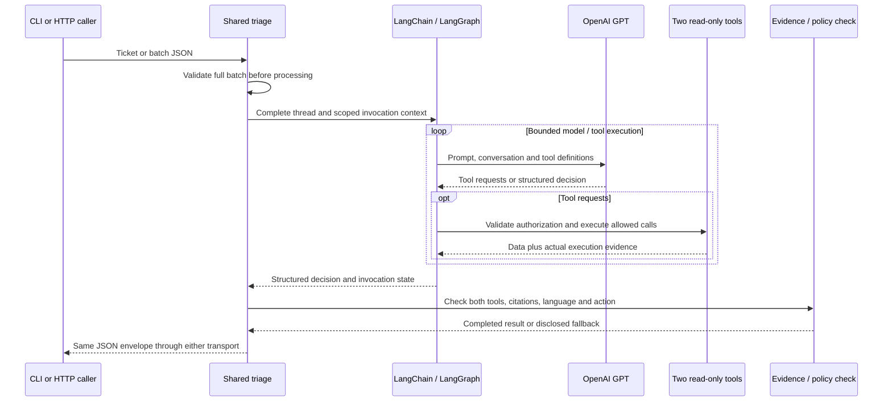
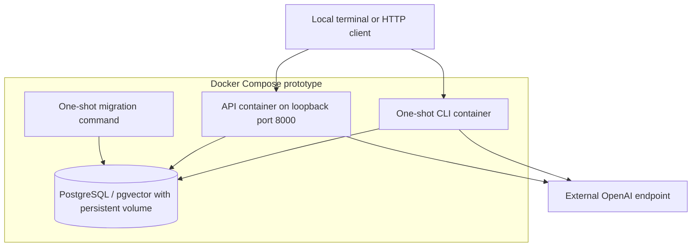

# LangChain / LangGraph Triage Specification and Plan

Status: design and F01–F03 ticket breakdown approved by the owner on 2026-10-09. F01–F03 implementation and delivery verification are complete. Live GPT/semantic quality and reviewer access remain explicitly unverified. Keep planning updates and task evidence in this file.

Branch: `feat/langchain-langgraph`, based on `feat/triage-agent` at `c295253`. The previous prototype remains available on its delivery branch.

## Problem Statement

The owner wants a smaller, readable framework implementation of the main Word assignment, usable from both terminal and HTTP. The current prototype has a custom model/tool loop, a bulky canned demonstration model and terminal-only access. A migration must avoid replacing those with a larger custom framework abstraction or duplicating decision logic across transports.

## Solution

Use one LangChain agent running on LangGraph, two scoped read-only tools and one shared batch triage function. CLI and FastAPI expose the same ticket/result contracts. Reuse Docker PostgreSQL classic RAG and existing fixtures/prompt, validate results against real execution evidence, and deliver a one-page architecture/failure/evaluation write-up. Keep design, implementation steps and evidence in this single planning document.

## User Stories

1. As a support operator, I want terminal ticket triage, so that I can process saved conversations.
2. As an integrating developer, I want HTTP ticket triage, so that another application can use the same agent.
3. As a developer, I want shared triage logic, so that terminal and HTTP results cannot drift.
4. As a reviewer, I want the whole conversation preserved, so that evolving impact drives urgency.
5. As a Thai customer, I want original text and Thai drafts preserved, so that language handling is reliable.
6. As a support operator, I want four urgency levels, so that attention matches reported impact.
7. As a support operator, I want product, issue type and sentiment extracted, so that decisions explain the case.
8. As a customer, I want separate issues retained, so that a feature request is not lost inside a bug report.
9. As a support operator, I want customer-history lookup, so that available context informs triage.
10. As a reviewer, I want missing history disclosed, so that missing records are not fabricated.
11. As a support operator, I want relevant knowledge passages, so that proposed responses have evidence.
12. As a reviewer, I want actual source citations, so that model claims can be checked.
13. As a reviewer, I want both required tools evidenced, so that a plausible decision cannot pretend execution.
14. As a customer, I want my history scoped to my ticket, so that another customer's records cannot leak.
15. As an operator, I want three next-action choices, so that cases can be drafted, routed or escalated.
16. As an operator, I want visible fallback on failures, so that failed automation requests human review.
17. As an owner, I want bounded provider/tool calls, so that runaway execution cannot exhaust cost or time.
18. As a reviewer, I want mock evidence labeled, so that demonstration data is not mistaken for company policy.
19. As an integrating developer, I want consistent JSON and explicit error behavior, so that clients can handle outcomes.
20. As an integrating developer, I want request isolation, so that simultaneous requests cannot share ticket evidence.
21. As a developer, I want invalid batches rejected before work, so that malformed input does not trigger paid calls.
22. As a developer, I want uv-locked dependencies and Docker setup, so that a fresh clone is reproducible.
23. As a reviewer, I want tool schemas and implementations delivered, so that agent capabilities are inspectable.
24. As an owner, I want one-page architecture and evaluation notes, so that submission meets the assignment limit.
25. As a reviewer, I want live GPT checks distinguished from fake-model tests, so that quality claims are honest.
26. As a developer, I want obsolete loop/demo code removed after replacement, so that one production agent remains.
27. As an owner, I want fewer planning files, so that the repository stays easy to read.
28. As a reviewer, I want a documented submission branch and access, so that I can obtain the intended implementation.

## Implementation Decisions

- The original Word assignment governs behavior and deliverables. Both terminal and HTTP access, LangChain/LangGraph, uv and Docker classic RAG are the owner's additional scope.
- Prefer LangChain create_agent on LangGraph over a custom graph. A custom graph is an alternative only if required behavior cannot be implemented clearly with the standard agent and small middleware.
- Use an OpenAI GPT integration, structured decision output, two read-only tools and final application-owned evidence/policy checks. The model cannot author trusted tool records or execution status.
- Reuse existing ticket, history, knowledge and decision contracts where compatible. One batch validator and one triage function serve both transports; transport modules contain no routing logic.
- Terminal and HTTP accept one ticket or one-to-one-hundred unique tickets. Malformed/invalid batches execute neither provider nor tools.
- HTTP uses POST /triage, returning the shared JSON envelope. Invalid input is HTTP 422; required configuration unavailable is sanitized HTTP 503. Accepted batches are HTTP 200 with explicit per-result completion/fallback status.
- A liveness endpoint describes process health only. The HTTP listener remains local; no public hosting or authentication system is added in this phase.
- Customer scope, retrieved documents and tool execution records belong to one invocation. No mutable global trace, persistent conversation memory or checkpoints.
- Preserve existing PostgreSQL ingestion/search and embedding-space protection. Framework graph execution is distinct from GraphRAG; no graph knowledge database is introduced.
- Approved intentional changes: no canned production model on this branch, zero automatic provider retries, and critical incident routing taking priority over billing routing. Preserve equivalent requirements and explicit failures; approval granted 2026-10-09.
- Limit each run to six model requests and eight tool calls, with thirty-second provider timeouts. Distinguish recursion steps and structured-output helpers from real tools and call budgets.
- Shortest readable code means fewer necessary concepts and repeated paths. Do not compress code, delete validation or merely move prose to claim a reduction.
- Keep one system prompt, existing package resources, a shared result contract and one production framework agent. Add no second agent architecture or generic tool registry.
- Reuse the existing README and one-page write-up artifacts. This document contains the specification, architecture, tasks and evidence; no extra planning file is needed.

## Testing Decisions

- Highest shared runtime seam: batch triage with actual tools against Docker PostgreSQL and an injected scripted chat model. Assert outcomes, real tool records, grounding, scoped history and fallback instead of private helper structure.
- Reuse prior agent, CLI, policy, provider-contract and real-database tests where their behavior still applies. Replace tests coupled solely to the removed custom-loop implementation.
- Approved HTTP seam: HTTP requests through FastAPI's test client. Compare HTTP and CLI outcomes for the same injected model/tool results; cover schema errors and concurrent request isolation. Design/seam review approved before implementation.
- Exercise the three faithful source tickets, all twelve messages, unknown/foreign customers, invented citations, provider/DB failures, invalid calls, bounded execution, critical billing and Thai drafts.
- Verify fresh-clone locked install, package resources, migration/ingestion, terminal/API startup and complete Docker tests. Run no tests merely to mirror moved helpers.
- Test live GPT using the three source conversations plus unseen cases with an owner-supplied key. Evaluate live semantic embeddings independently of deterministic fake vectors. Disclose unavailable live evidence.
- Verify exactly one rendered write-up page and complete tool definitions. Measure readability/duplication and runtime size before/after; file or line reduction alone is not acceptance.

## Out of Scope

- GraphRAG, graph databases, multi-agent supervisors, custom chat UI, persistent conversation memory and checkpoints.
- Public deployment, authentication implementation, background jobs, billing/account changes or sending customer replies.
- Automatic completion of implementation merely because this spec is published; design approval still precedes coding.
- Guarantees of live-model correctness or an arbitrary line-count target.
- Replacing the chosen knowledge backend or creating parallel planning/ticket artifacts.

## Further Notes

Published specification: [GitHub issue #6](https://github.com/Watcharaphong-kob/support-ticket-triage-agent/issues/6), labeled ready-for-agent. The owner approved the design and breakdown on 2026-10-09; task evidence follows below.

This framework implementation on feat/langchain-langgraph is based on completed prototype c295253. F01–F03 deliver the framework agent, shared HTTP/terminal access and verified packaging/documentation. Runtime code decreased from 1,054 to 974 nonblank Python lines; tracked files decreased from 80 to 60. Original custom-loop prototype and its historical docs remain on feat/triage-agent.

Terminal/tool/database testing seams are reused. The HTTP seam and retry/offline/routing changes were approved, tested and reviewed. The implementation checklist and actual evidence stay in this document. The owner's earlier classic-RAG-only and prototype decisions remain in force.

## System architecture

These diagrams describe the implemented framework/API architecture. LangGraph is the execution runtime; PostgreSQL remains the knowledge store.

### 1. Modules and trust

Customer text, knowledge excerpts and model output are untrusted. Only actual application tool execution supplies trusted IDs/status/citations. Both transports cross the same triage interface; their output formats do not introduce independent decisions.

| Responsibility | Ownership | Why it stays small |
| --- | --- | --- |
| Transport | CLI and HTTP entry points | Parse/serialize; call shared triage |
| Contracts | Existing Pydantic schemas | One definition for both entry points |
| Agent orchestration | Standard LangChain agent running on LangGraph | No second hand-written loop |
| History and retrieval | Two scoped tools and existing knowledge implementation | Reuse fixtures and classic RAG |
| Evidence and action checks | Existing policy plus per-invocation evidence | Validate actual execution, not model claims |
| Runtime configuration | Existing environment configuration | No settings framework or persistent agent state |

### 2. One ticket execution

Invalid input stops before the graph runs. Tool/provider errors, exhausted limits or unverifiable evidence become visible fallback. A graph recursion limit is not the number of model calls; the separate call-limit middleware enforces budgets.

### 3. Local Docker deployment

CLI and API use one application image with different entry commands; no additional database or agent process is required. API startup and CLI execution depend on healthy PostgreSQL and completed migration. Knowledge ingestion is an explicit setup command. Secrets stay in the ignored environment file; no key appears in delivered source or diagrams. Liveness indicates the process is running, not that provider/DB calls will succeed.

- Reuse the existing Pydantic ticket, tool and result contracts, prompt, customer fixtures and PostgreSQL knowledge implementation.
- Keep one batch validator and one batch triage function. CLI and API handle transport only; neither implements routing or model logic.
- Replace the custom agent loop and direct GPT adapter with `create_agent` and `ChatOpenAI` after framework-level tests establish equivalent required behavior.
- Return an internal structured decision from the model. Tool execution records, ticket identity, status and errors are application-owned; never trust the model to supply them. Final validation builds the public result from actual execution evidence.
- Prefer provider-native structured output with a compatible configured GPT model. Document the required model capabilities. If a tool-based output strategy is needed, distinguish its synthetic output tool from the two real assignment tools and include it in budget accounting.
- Keep all request state local to a ticket invocation. Customer scope, tool records and retrieved documents must never leak across API requests.
- Keep PostgreSQL/pgvector, ingestion and embeddings intact initially. No new LangChain database integration package is needed to call the existing search implementation.

### Simplicity rules

- Fewer concepts and duplicate paths matter more than raw line count. No compressed one-liners or deleted protections to meet a target.
- Add only `api.py` as a runtime file unless a concrete responsibility requires another file. Prefer modifying the existing agent, tools, schemas and CLI modules.
- Remove superseded custom-loop/provider code after the replacement passes; do not retain two production implementations on this branch.
- Remove the bulky canned production model when replaced; use injected scripted/fake chat models in tests. The framework branch's documented runtime is live GPT. Existing offline-demo behavior remains available on the original branch; README must make this intentional difference clear.
- Reuse the current prompt and package resources; do not create additional prompt copies.
- Record before/after nonblank runtime lines and actual files/concepts removed. Current baseline: 1,054 nonblank runtime Python lines and 80 tracked repository files. CLI plus API adds capability, so do not claim improvement solely from a line-count comparison.
- This planning stage adds only `plan.md`. Later planning/checklists/evidence remain in this file and README; no new planner, ticket-copy, diagram or research files.
- Existing inherited documents remain intact during this plan-only stage. During delivery, remove obsolete generated planning copies only after preserving requirements and useful evidence in the retained documents; update CI accordingly.

## Terminal and API contract

### Shared behavior

- Accept one existing `Ticket` object or a list of 1-100 tickets; reject empty batches and duplicate ticket IDs before invoking the model or tools.
- Preserve original message order, Thai characters, relative times and supplied translations.
- Return one JSON envelope containing mode, embedding model and a result per ticket, consistent across transports. Runtime mode is `live_gpt`.
- Completed results require both actual tools, valid citations and action-policy checks. Missing history is disclosed; tool failures and unverifiable decisions produce a visible human-review fallback.

### Terminal

- Retain `python -m triage_agent --input data/sample_tickets.json --trace` and the installed `triage-agent` command.
- Stdout is JSON; safe trace records go to stderr.
- Exit 0 for all completed results, 1 if any result falls back, and 2 for invalid input/configuration.

### HTTP

- Use FastAPI with one `POST /triage` endpoint accepting the shared input contract and returning the same envelope as the CLI.
- Return HTTP 422 for invalid ticket JSON, empty/oversized batches or duplicate IDs before processing. Return sanitized HTTP 503 for unavailable required runtime configuration.
- Validly accepted batches return HTTP 200 even when individual results contain fallback; clients inspect each result's status/error. Document this explicitly rather than hiding failures.
- Add `GET /health` for process liveness only; do not describe it as database/model readiness. FastAPI's existing OpenAPI/docs pages supply request documentation; no custom UI.
- Use a synchronous endpoint so blocking graph/database work executes through FastAPI's worker mechanism. Build ticket-specific execution state inside the shared function, not a global mutable trace.
- Serve locally on port 8000; Docker publishes to loopback. Auth, external hosting and deployment are outside this prototype.

## Tool definitions

Use LangChain tools with existing Pydantic argument schemas and short descriptions. Return model-visible data plus application-owned execution evidence using supported tool results/artifacts; verify the selected framework version's behavior before relying on it.

| Tool | Argument schema | Implementation | Observable outcomes |
| --- | --- | --- | --- |
| `get_customer_history` | Required nonempty `customer_id`; reject extra fields | Read synthetic customer fixtures; enforce the current ticket's customer scope | `ok`, `not_found`, or sanitized `error`; mock provenance explicit |
| `search_knowledge_base` | Required nonempty query, at most 8,000 characters; optional product, issue type and English/Thai locale filters | Existing read-only PostgreSQL exact-vector search, top five passages | `ok` with actual source/chunk IDs, excerpts and mock flags; empty success differs from failure |

Do not count structured-output helpers as either required tool. Do not add refund, account-update, shell or arbitrary-SQL tools. Each completed ticket must contain verifiable records of both real tools.

## Failure handling and policy

- Set provider timeout to 30 seconds and disable SDK retries. For this branch, prefer immediate disclosed fallback over recreating the old custom correction/retry loop; this is an intentional simplification to document and test.
- Use built-in per-run model/tool limit middleware: at most six model requests and eight tool calls. A separate graph recursion guard must be documented as a graph-step limit, not a substitute for either call budget.
- Fail closed for unknown tools, malformed arguments, foreign customer access, invalid call IDs, tool/provider errors, invalid structured output, missing required tool evidence or invented citations. Preserve pre-execution rejection of unauthorized calls; check full batches before any execution where necessary.
- Do not rely on prompt instructions alone for authorization or citation validity. Keep application checks small and concentrated in the existing tool/policy modules.
- Define routing precedence explicitly: critical impact routes to incident review; otherwise billing issues route to human billing review; otherwise apply the proposed action with existing evidence checks. This resolves the original critical-plus-billing destination conflict; the regression test passes.
- Auto-response remains draft-only, low urgency, supported by retrieved evidence and known customer history. No response is sent automatically.
- Preserve missing-history uncertainty and mock-knowledge labeling. Thai tickets require Thai drafts. Treat customer/knowledge content as untrusted data; semantic grounding still requires evaluation.
- Prevent embedding-space changes from contaminating an existing index; continue using a separate database/volume for a different model or dimension.

## Dependencies and files

Use Python 3.11+, uv, LangChain, LangGraph, `langchain-openai`, Pydantic, FastAPI and Uvicorn; reuse existing PostgreSQL/pgvector/tokenization dependencies and pytest/Ruff. Resolve compatible versions during implementation and commit the uv lockfile; do not guess pins in this plan.

Expected modifications: `pyproject.toml`, `uv.lock`, existing agent/tools/schemas/policy/CLI modules, Docker Compose, README, existing prompt where necessary, and relevant tests. Add `src/triage_agent/api.py` plus focused framework/API tests. Remove obsolete runtime code only after replacement verification.

Keep `WRITEUP.pdf` at the root; update its existing editable source rather than creating another write-up. The current documentation/reader tooling must either stay valid or be intentionally retired from this branch with CI updated; do not leave broken generation checks.

## Delivery checklist

Each task consults ask-matt before and after, uses tests at public seams, and records actual skill/plugin usage and results here. Never report a planned test as passed.

### F01 — Framework agent through the terminal

GitHub: [#7](https://github.com/Watcharaphong-kob/support-ticket-triage-agent/issues/7). Done.

- [x] Write failing framework-level tests: full thread reaches the model, both real tools execute, actual tool IDs/citations are retained, unauthorized customer access cannot execute.
- [x] Run those tests and confirm meaningful failures against the current custom-loop implementation.
- [x] Add locked framework dependencies; adapt the two tools; replace the loop with `create_agent`; preserve shared result validation and visible fallback.
- [x] Test provider/tool failures, unknown calls, budget exhaustion, forged citations, missing history, Thai drafts and critical billing precedence.
- [x] Demonstrate all three original tickets through the terminal using an injected scripted model against real Docker PostgreSQL. This proves framework wiring, not GPT quality.
- [x] Run focused tests, review the diff and commit a working terminal slice. Record results here.

### F02 — HTTP access to the same agent

GitHub: [#8](https://github.com/Watcharaphong-kob/support-ticket-triage-agent/issues/8). Done; native blocker #7 completed.

Blocked by F01.

- [x] Write failing API tests for one ticket, batch input, invalid JSON/schema, empty/oversized batches, duplicate IDs, fallback output and missing configuration.
- [x] Add the small FastAPI module and local Docker/API startup command; reuse the shared batch validator and triage function.
- [x] Compare API and CLI envelopes for identical injected model/tool results. Test simultaneous requests to prove customer/evidence isolation.
- [x] Verify invalid requests invoke neither model nor tools, Thai JSON survives HTTP, and health reports liveness accurately.
- [x] Run terminal + API tests, review the diff and commit a working dual-entry-point slice. Record results here.

### F03 — Submission and quality evidence

GitHub: [#9](https://github.com/Watcharaphong-kob/support-ticket-triage-agent/issues/9). Done; native blocker #8 completed.

Blocked by F02.

- [x] Remove superseded custom-loop/canned-model code and obsolete generated planning copies only where the retained implementation/docs cover their useful behavior and evidence.
- [x] Update README with uv/Docker setup, ingestion, terminal commands, HTTP examples, compatible GPT configuration, failures and exact tests. Adding an environment file alone is not DB startup/ingestion.
- [x] Deliver the system prompt and tool definitions; verify installed prompt/migration resources and packaged entry points.
- [x] Write and render the one-page architecture/failure/evaluation PDF; inspect layout and verify exactly one page.
- [x] Run locked install, Ruff, package builds, complete Docker database tests, terminal and HTTP samples, and fresh-clone startup. Record test counts and before/after runtime complexity.
- [x] Disclose live GPT and semantic embedding evaluation as unperformed: no owner-provided credentials were used. Scripted tests do not establish semantic quality.
- [x] Review the entire branch against the Word requirements and this plan; verify the branch URL and document private-repository reviewer access requirements. Actual reviewer access remains unconfirmed; the owner must grant access before submission.

## One-page write-up outline

Use three compact sections in the existing write-up, with no task history:

1. **Architecture and why:** shared CLI/API triage function, LangChain agent running on LangGraph, two read-only tools, structured output/evidence validation, Docker classic RAG; explain why a custom graph/checkpoint system was unnecessary.
2. **What can go wrong and handling:** ambiguous or multi-issue tickets, prompt injection, missing customer history, provider/DB failures, loops, forged/stale citations, mock evidence and embedding mismatch; bounded execution, scoped tools and disclosed fallback.
3. **Production evaluation:** labeled multilingual held-out tickets; urgency/action/product/issue/sentiment accuracy; critical-case false negatives; citation relevance/support; unsafe automation rate; latency, token cost and fallback rate; regression checks and human review before deployment.

## Acceptance and review gate

- The main Word deliverables are present, with terminal **and** API support as requested.
- Both entry points use the same agent and observable contracts; no duplicated decision logic.
- Tool definitions include schemas, descriptions and implementations; both real tools are evidenced before completion.
- Code gets simpler by removing a second implementation and repetition, not hiding complexity or dropping checks.
- Write-up is verified as one page and covers all three requested topics.
- No secrets, paid keys or unnecessary new planning files are committed.
- The owner approved the architecture, API contract and retry/offline/policy changes on 2026-10-09. This file records implementation steps, progress and evidence.

## Primary references checked

- [LangChain agent stack and LangGraph relationship](https://www.langchain.com/oss-overview)
- [LangChain agents](https://docs.langchain.com/oss/python/langchain/agents)
- [Structured output](https://docs.langchain.com/oss/python/langchain/structured-output)
- [Built-in model/tool limit middleware](https://docs.langchain.com/oss/python/langchain/middleware/built-in)
- [FastAPI request bodies](https://fastapi.tiangolo.com/tutorial/body/)

Skill usage during the original plan/spec stage: ask-matt before/after, to-spec, Superpowers brainstorming, reuse of the existing isolated worktree, primary documentation verification and pre-delivery checks. No framework dependencies or runtime code were installed/changed while writing the plan.

## Implementation evidence

### F01 — verification before review (2026-10-09)

- Approved design and three-ticket breakdown published as #7, #8 and #9, with native parent #6 and blocking edges #8←#7, #9←#8. The parent specification body was not modified.
- Skills: ask-matt pre-task routing, to-tickets, implement, tdd / Superpowers test-driven-development, systematic-debugging, verification-before-completion; existing isolated worktree reused. Plugins/tools: GitHub connector and native GitHub REST links, shell, uv, Docker. Code review follows this verification.
- Steps: locked LangChain 1.4.4, LangGraph 1.2.14 and langchain-openai 1.7.0; replaced the custom loop with create_agent; retained real read-only tools and application-owned evidence; extracted shared batch triage; removed the canned production model; migrated behavioral tests.
- RED→GREEN observed for framework chat integration, unauthorized whole-batch rejection, safe no-retry failures, model/tool limits, critical billing precedence, configured provider and truncated output. Eight actual tools plus one output helper can complete; the helper is not required-tool evidence. Graph recursion cap is 40 steps.
- Full Docker suite: 68 passed, 1 host-only skip. Real PostgreSQL and all three source-ticket wiring tests passed; scripted model/fake embeddings do not establish GPT or semantic quality.
- Host suite outside the restricted sandbox: 61 passed, 8 DB/container skips. Ruff check/format passed. Initial restricted host run had tokenizer-network/temp permission failures; the unrestricted host run and rebuilt Docker run resolved those environment limitations.
- Live GPT and semantic embedding quality not checked. Framework branch runtime requires reviewer-supplied GPT credentials; deterministic models exist only in tests, and the original offline demo remains on feat/triage-agent.

F01 post-task ask-matt: verification complete → code-review → next frontier F02. Standards: zero violations, one nonblocking schema-ownership duplication addressed in tools.py and re-reviewed with no findings. Spec: zero findings. Final rebuilt Docker suite after that refactor: 68 passed / 1 host-only skip; host Compose check 1 passed. No live quality claim. F01 implementation commit cc85d6b; follow-up review cleanup committed next.

### F02 — verification before review (2026-10-09)

- Pre-task ask-matt: implement / TDD at the approved HTTP seam; reuse F01 shared triage. Skills: ask-matt, implement, tdd / Superpowers test-driven-development, systematic-debugging, verification-before-completion; code-review follows. Tools/plugins: shell, uv, Docker; FastAPI primary docs checked.
- Steps: lock FastAPI 0.143.0 and Uvicorn 0.54.0; add one 26-line HTTP transport module; expose POST /triage and GET /health; add loopback Docker API service sharing the application image/DB/migration; default API_PORT=8000.
- RED→GREEN: missing HTTP routes and missing Compose API service. Reused real triage for CLI/API parity and concurrent request isolation; invalid requests invoke no provider/tools, accepted failures remain explicit result fallbacks in HTTP 200, missing config is sanitized 503 and malformed input is 422.
- Full rebuilt Docker suite: 78 passed, 1 host-only skip. Includes actual PostgreSQL parity, Thai output and barrier-forced concurrent requests. Host API checks: 8 passed / 2 DB skips; host Compose check: 1 passed. Local HTTP /health and /openapi.json responded correctly. Ruff and whitespace checks passed.
- Restricted Windows TestClient run stalled; terminated and used the unrestricted host run plus Linux Docker suite. No live GPT/semantic quality calls; deterministic injected chat models are test-only.

F02 post-task ask-matt: HTTP verification → standards/spec review → F03 delivery frontier. Standards: no violations; optional repeated test config consolidated in a small fixture. Spec: no findings. After cleanup, real DB API tests: 10 passed (read-only test mount); forced concurrent isolation also passed with inherited live-embedding config overridden by the fixture. Rebuilt image suite before test-only cleanup: 78 passed / 1 host-only skip. F02 implementation commit f621598; final no-mount image suite follows in F03.

### F03 — reproducible delivery (2026-10-09)

- Pre-task ask-matt: implement the delivery ticket, then verify public installation/transport seams and run both code-review axes. Skills used: ask-matt before/after, implement, code-review, verification-before-completion, PDF render/inspection and finishing-a-development-branch. Existing isolated worktree retained. Tools/plugins: shell, uv, Docker, GitHub connector/REST and bundled PDF tooling. No new planning files were added.
- Steps: rewrite README for the actual framework CLI/API and uv/Docker commands; update requirement traceability and the one-page write-up; replace the obsolete reader/planning generator with a small stdlib generator; remove 20 superseded documentation files and two obsolete canned-output examples. Original artifacts remain in the original branch history.
- Faithful source check: all 35 Word paragraphs match assignment_source.json. Original conversations and all twelve messages remain covered by fixture tests. Installed wheel contains the prompt, migration SQL and API; the removed custom model module is absent.
- Fresh remote clone of feat/langchain-langgraph at a90e2c5: uv locked install and wheel/sdist builds passed. Isolated Docker Compose DB/API started; migration succeeded; ingestion returned three documents/three chunks. The freshly built image, without source mounts, passed 78 tests with one host-only skip. Installed terminal entry point returned version 0.1.0; all three source samples have CLI/API parity tests against actual PostgreSQL and injected chat models.
- Actual HTTP smoke checks passed: health reported alive; sample POST without GPT credentials returned the documented sanitized 503. Verification containers/network were stopped; the separate verification volume and original prototype services were preserved.
- Final Windows host suite: 69 passed, 10 DB/container skips. Ruff check/format passed. Reader source/link/resource checks passed. Reader content was deterministic; explicit LF output prevents Windows newline conversion from leaving a misleading Git dirty flag.
- PDF: 318-word source, exactly one rendered A4 page, all three required topics present; visual inspection found readable text without clipping or overlap. Runtime Python: 16 files, 974 nonblank lines versus 1,054 baseline. Tracked files: 60 versus 80 baseline.
- Independent full-branch reviews against c295253: Standards zero violations/actionable smells; Spec zero actionable findings. Hosted CI for a90e2c5 succeeded: [run 37931409462](https://github.com/Watcharaphong-kob/support-ticket-triage-agent/actions/runs/37931409462).
- Live GPT and semantic embedding quality were not evaluated. Test chat models and fake vectors prove wiring and safeguards only. README describes the required live evaluation and separate embedding-space volume.
- Correct delivery branch: [feat/langchain-langgraph](https://github.com/Watcharaphong-kob/support-ticket-triage-agent/tree/feat/langchain-langgraph). Repository remains private. No reviewer identity/access was supplied; the owner must grant reviewer access before submitting this URL. No public deployment, merge or customer reply was performed.

F03 post-task ask-matt: delivery verification and two-axis code review complete → retain the requested alternate branch and worktree. F01–F03 are complete; live-quality evidence and reviewer access are disclosed remaining submission prerequisites, not silently reported as passed.
